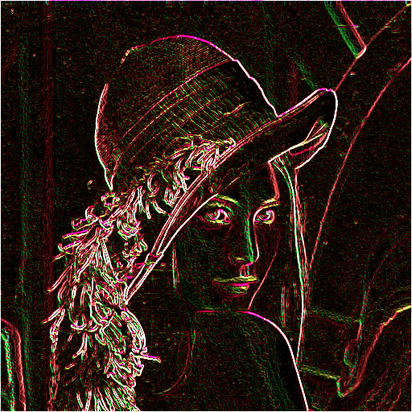

# Edge Detection
> This program detects edges using sobel operator in bmp type files.
> Made by SWD team for Gdansk University of Technology Hackathon 4.01.2022

## Table of Contents
* [General Info](#general-information)
* [Technologies Used](#technologies-used)
* [Features](#features)
* [Screenshots](#screenshots)
* [Setup](#setup)
* [Usage](#usage)
* [Project Status](#project-status)

## General Information
- Program detects edges
- There are 4 diffrent methods
- Last one uses hsv, where h angle is the angle of the edge

## Technologies Used
- C++

## Features
- Sobel operator using average value of masks. [More info](https://pl.wikipedia.org/wiki/Sobel)
- Sobel operator using average absolute value of masks.
- Sobel operator using Geometric mean of masks.
- Sobel operator using with coloring.

## Screenshots

## Setup
Project uses standard C++ libraries.

## Usage
Insert location of your bmp image. Then the program will output a processed bmp image.

## Project Status
_complete_
